# Apiaster

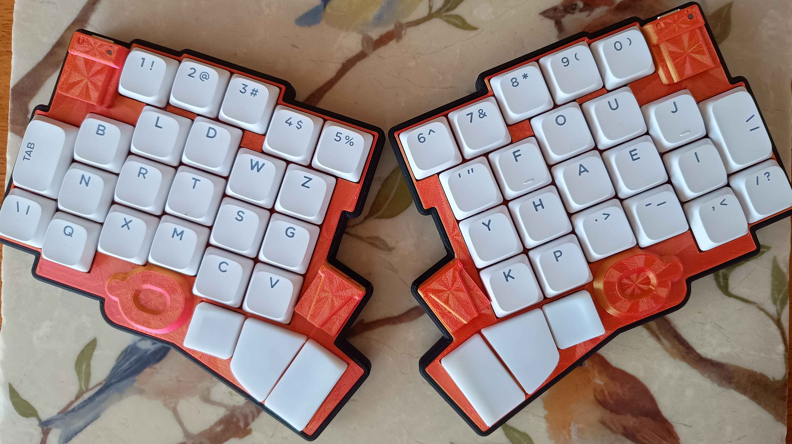
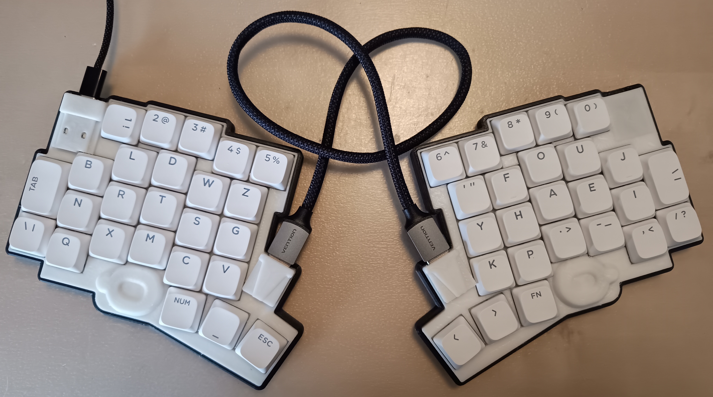
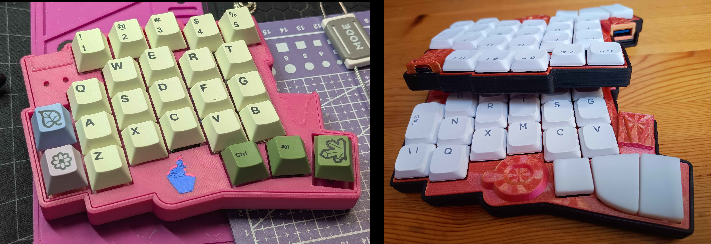
Apiaster is a 50-key split keyboard with both an MX and a Kailh choc (v1 & v2) version. It is designed with price and flexibility in mind. The Apiaster is named after the [European bee-eater](https://en.wikipedia.org/wiki/European_bee-eater). Apiaster runs [ZMK firmware](https://zmk.dev/), with the customisation of keymaps, layers, and behaviors allowing it to output every key present in a 108-key 100% keyboard *and more*. **In its most basic form, Apiaster can be built for a total of $36.35 in parts, not including shipping/tariffs/customs or tooling. A version costing $39.11 can be "upgraded" with additional features such as Bluetooth over time.**

# Motivation

There are a number of reasons why someone might be interested in a split, column-staggered[^1] keyboard such as the Apiaster. Most commonly, ergonomics and comfort. Ergonomics is something that tends to be specific to each individual though, making selecting such a keyboard difficult. Both individuals lost for choice and individuals who have amassed a collection of three or more keyboards in the search for their perfect ergonomic experience are not uncommon to see.

Apiaster was designed with flexibility in mind, in particular:
1. The thumb cluster can be snapped off and moved. The case is generated from a script, allowing it to be moved to most reasonable locations (as long as it doesn't collide with the rest of the PCB).
2. The optional choice of reduced inner keys, reducing the strain on the index fingers by avoiding some particularly uncomfortable keys (B and N in a QWERTY layout).
3. The optional choice of an alternative thumb cluster I designed, which brings the thumb keys closer together than would be possible with standard keycaps.

| 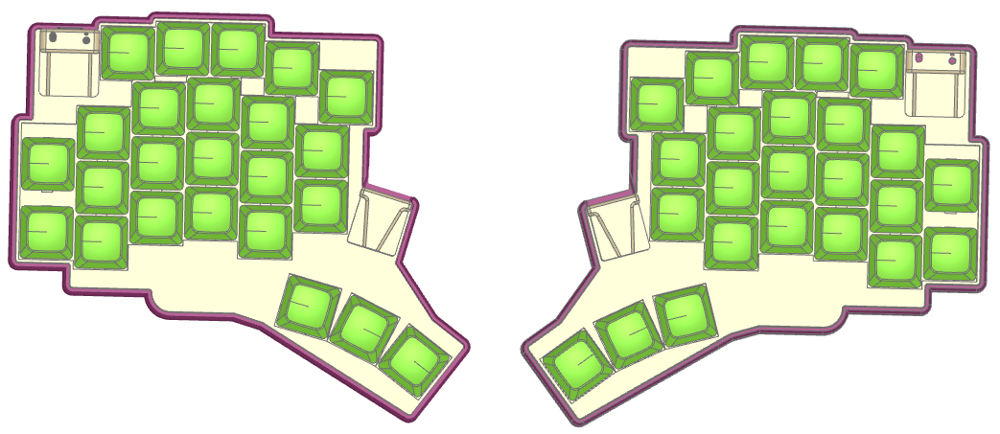 | 
|:--:| 
| *Render showing some of these adjustments* |

This extra flexibility allows individuals to tune the Apiaster to their liking, either providing them with a suitable "endgame" or allowing them to narrow down what specific layout they want quicker. 

## Price

Cost is one of the biggest barriers to entry for ergo-split keyboards. A set of keycaps and switches alone costs more than a cheap basic membrane keyboard. Commercial offerings tend to be either expensive or unreliable. To reduce this barrier to entry, Apiaster is flexible once more:

1. The MCU can be a single rp2040-zero (around 2-3$) with both halves connected via a wire, a single Seeed Studio XIAO (either rp2040 or nrf52840, the latter of which allows the keyboard to have BLE), or a pair of Seeed Studio XIAO nRF52840's (Fully wireless keyboard, no wire between halves).

| 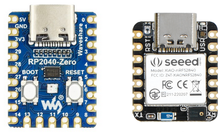 | 
|:--:| 
| *RP2040-Zero on the left, XIAO nRF52840 on the right* |

3. There are options for both MX and Choc switches, albeit with different PCBs. MX switches are high profile and cheap, with lots of options. Choc switches are low profile and pricier.

| 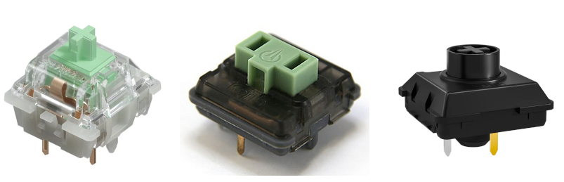 | 
|:--:| 
| *MX (18mm), Choc v1 (10.6mm), Choc v2 (12mm) in that order.* |

4. The PCB itself is designed to be reversible, reducing ordering costs from PCB manufacturers (these have a min order number of 5 PCBs).
5. Apiaster can be powered (on wireless) via either a LiPo battery (more capacity, difficult to source reliably) or from a rechargeable coin cell battery

| 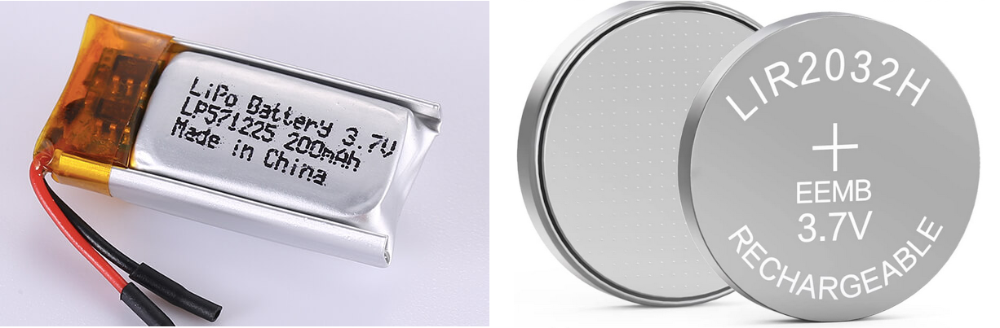 | 
|:--:| 
| *LiPo on the left, coin cell on the right. The ordering guide informs you of dimensional constraints for a LiPo battery.* |

## Mouse

With a split-ergo keyboard, reduced mouse usage is common, and some go so far as to build a pointing device such as a trackball or a trackpad into their keyboard. In theory, Apiaster *should* also have this capability (on the right hand side only, when used via Bluetooth only). However, this is currently untested and lacks case adjustments as I do not have the hardware to implement and test such a pointing device. 

[^1]: The number row is also row-staggered, this will be discussed in the next section.

# Ergonomics

Keyboard ergonomics is a complex topic. There is a lack of research in the particular topic of how beneficial a split keyboard actually is, despite plenty of individuals claiming their benefits - it is simply difficult to get the necessary participants and dedication to such a research study. Moreover, everything in the body is linked - some may find it more beneficial to get a more suitable chair, or a desk at a different height.

Without going into too much detail, I want to provide a brief overview of what is now commonly agreed upon, and how some of the design decisions of this keyboard were made as a consequence. A read of [this page](https://ergonomictrends.com/proper-ergonomic-typing-posture-at-computer/) can be a good introduction to some good typing habits.

## Why Split

There are multiple benefits to a fully split keyboard, i.e. one that consists of two completely separated halves. The obvious intuitive reason is that you can dedicate one half to each hand, but let's explore the rabbit hole a bit, shall we? 

For long-term comfortable typing, a [neutral wrist position](https://ergonomictrends.com/types-of-wrist-movements-and-injuries/) is preferred. Not a *perfectly* neutral position, at least not for most people, but a comfortably neutral position. 

Your shoulders are on the side of your torso. If your keyboard is directly in front of you and you try to place your hands in line with your keyboard, then you cause ulnar deviation. Most people who learned to type naturally, i.e. were not taught bad typing habits in a classroom, will have their hands at an angle to their keyboard when at rest. It makes sense to angle the keys that each hand uses towards them, to bring the keyboard in line with your arm and hand movement, encouraging a neutral wrist.

While there exist many designs for unibody keyboards which have angles between halves dedicated to each hand (e.g. the [ffkb](https://fingerpunch.xyz/product/faux-fox-keyboard-v4/)), a true split allows for every individual to angle the halves at whichever angle and distance is most comfortable to them. The angle at which you want your keyboard and how close you want the halves to be is related to how far away you want it from your torso.

### Tenting

Fully split keyboards also allow for [tenting](https://www.reddit.com/r/ErgoMechKeyboards/comments/1i2s2or/magsafe_is_the_most_underrated_tenting_solution/). This prevents over rotation of the wrist, allowing for a more neutral position. The ideal tenting angle is again, dependant on the individual and the distance at which the keyboard is from the user. 

### Other Benefits

Aside from the above ergonomic benefits, split keyboards are also just nice to have for some other, miscellaneous reasons. They free up space in the middle of your desk, perfect for a mug or a glass or especially for a cat that used to love lying on your keyboard. You can [mount the halves to your armrests](https://www.reddit.com/r/ErgoMechKeyboards/comments/1if5sec/magsafe_accessories_as_keyboard_mount_on/). While gaming, you can put away one half and free up a ton of room for your mouse. 

## Staggered Keys

Most keyboards commonly used today are "row staggered".

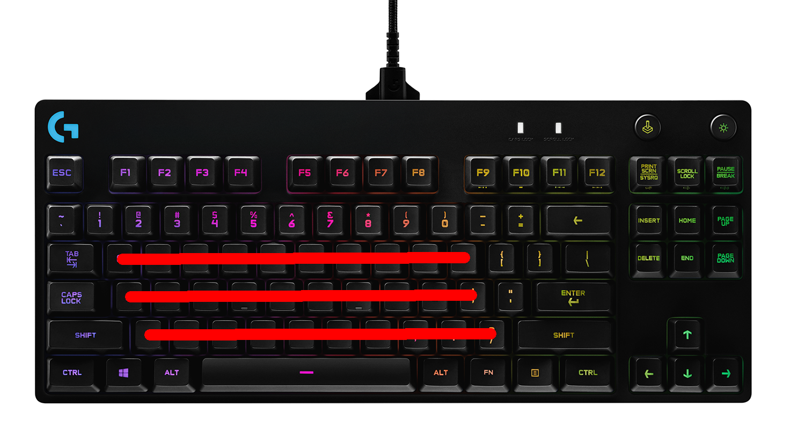

Row stagger originated with typewriters due to mechanical reasons, and it's just sort of....stayed. Row stagger forces your fingers to move from side to side as they move up and down rows. We can do better.

Column staggered keyboards stagger the keys in line with your fingers.
|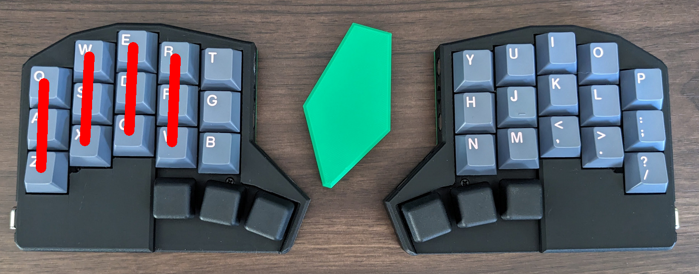| 
|:--:| 
| *[Menura](https://github.com/rmuraglia/menura-kb) Keyboard* |

The amount of stagger that is ideal is generally related to the lengths of each finger. Apiaster's stagger is not as mild as the [corne](https://github.com/foostan/crkbd), nor is it as extreme as the [ferris](https://github.com/foostan/crkbd). The ring finger stagger is slightly less than that of the index, making it more suitable for those whose ring finger is longer than their index, at the cost of being less suitable towards those with the opposite.

Some keyboards also introduce what is known as "splay", where the columns are no longer parallel to one another, but splay outwards. This is because for most people, our fingers will naturally splay outwards to some degree as they are stretched. 

|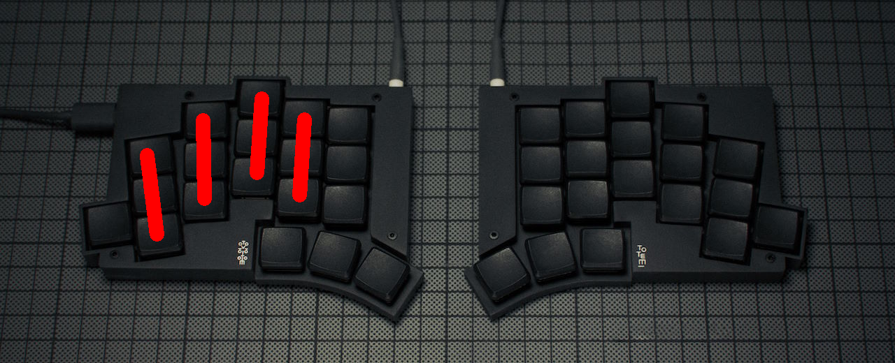| 
|:--:| 
| *[Totem](https://github.com/GEIGEIGEIST/TOTEM) Keyboard* |

### Apiaster

Apiaster features column stagger, but it also features a row staggered number row. The inclusion of a number row was desirable primarily because:

1. It is a less extreme drop in keys, making the keyboard more approachable. 
2. A number row is *highly* desirable for gaming. The key count and key positions of Apiaster were selected to be *just above* what I consider to be the minimum keycount desirable for gaming with one hand on the keyboard and the other on the mouse (My personal minimum is 23 keys, dropping one of the outer pinkies and one key from the inner index column).
3. I believe some occasional stretching of the fingers can be beneficial *if* that stretching is in line with the finger's natural path.

The number row was row staggered in addition to being column staggered for two reasons:

1. The pinky being so small for most people, if the number 1 was in line with the column your hand would have to move to reach it (or you would just be pressing it with your ring finger). The outermost upper pinky key is a more suitable place for a fourth pinky than in line with the column.
2. By row staggering the number row, it naturally somewhat imitates finger splay, but only when the fingers are further extended. This is when the splay becomes more obvious for most.

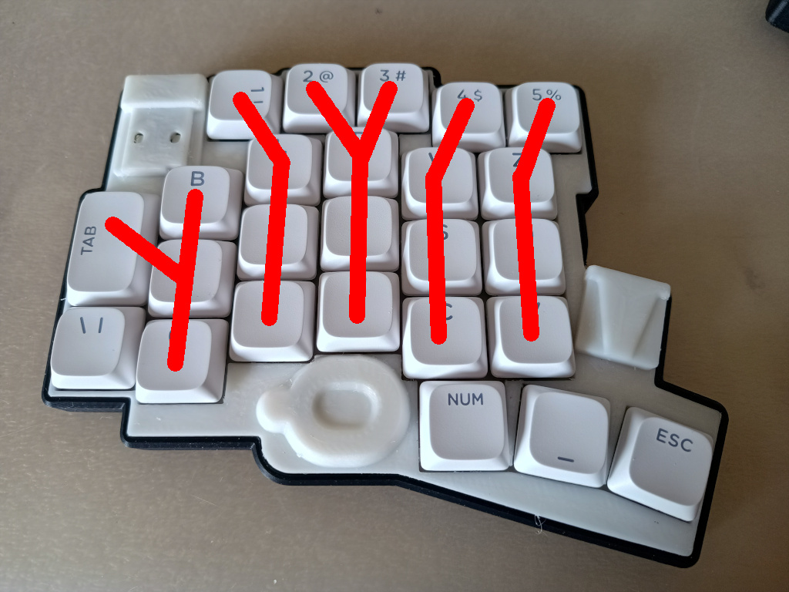

The specific values chosen for the row stagger also allow the ring and index finger to hit the 2 and 3 without issues, and it happens to closely match the relative stagger of the number row when fingers are resting on WASD on a standard QWERTY keyboard. (Gaming on this keyboard would use the keys labeled DRTS in place of WASD, though the positions matter, not the keyboard layout).

## Thumbs

Thumbs are underused massively with standard keyboards. Ergonomic keyboards will commonly take advantage of their split nature to offer a thumb cluster with more keys than just one.

The thumb cluster is the most difficult part of the keyboard to get right. Variations in hand size, thumb flexibility, etc. can cause wide variations in preferred hand positions. Compare the [corne]() to the [cheapino](https://github.com/tompi/cheapino) for example. The ability of the Apiaster to move the thumb cluster is very advantageous in this respect. There are still some points I wish to touch upon, though.

1. Tucking thumbs under your palm is generally seen as uncomfortable by most. Putting your thumb in line with your index finger is usually the most "inner" position that is still comfortable. Apiaster's minimum is slightly more outer than this.
2. Thumbs move in an arc, not up and down. Hence thumb clusters should do the same. 
3. The thumb cluster is generally recommended to be on the same plane (or a plane parallel to) the other keys. Otherwise you run an increased risk of [De Quervain Syndrome](https://en.wikipedia.org/wiki/De_Quervain_syndrome), a problem that is ever more likely to occur due to increased smartphone usage.
4. Minimizing movement of the thumb along the "fan" is seen as desirable. 

Apiaster is capable of having both standard keycaps at an 11 degree angle between keys or it can use a [thumb cluster](https://github.com/Nick-Munnich/ripple-thumb-keycaps) I designed, which has its own advantages (read the README in the repo) but unfortunately needs to be 3D printed.

# Ordering and Build Guide

The ordering and build guide for this keyboard can be found [here](docs/_START_HERE.md).

# Firmware

Firmware can be found [here](https://github.com/Nick-Munnich/zmk-apiaster-module).

# Acknowledgements and References

There are a number of people and projects which served as inspiration and motivation for this project. Thank you to Sadwitch and tompi (cheapino) for serving as initial inspiration for the concept, and again to Sadwitch for helping with various little bits. Thank you to carrefinho for letting me use some of their art. Thank you to petejohanson and bravekarma for all of their work on ZMK. Thank you to hookykb for writing the charlieplex driver, which this keyboard relies upon. Thank you to quappo for providing the inspiration for the inner key column alternative keys. Finally, thank you to sadekbaroudi and all of the lovely folks on the fingerpunch Discord. Keep being awesome.

Certain images in this README were taken from the websites of manufacturers or vendors and can be taken down on request.
