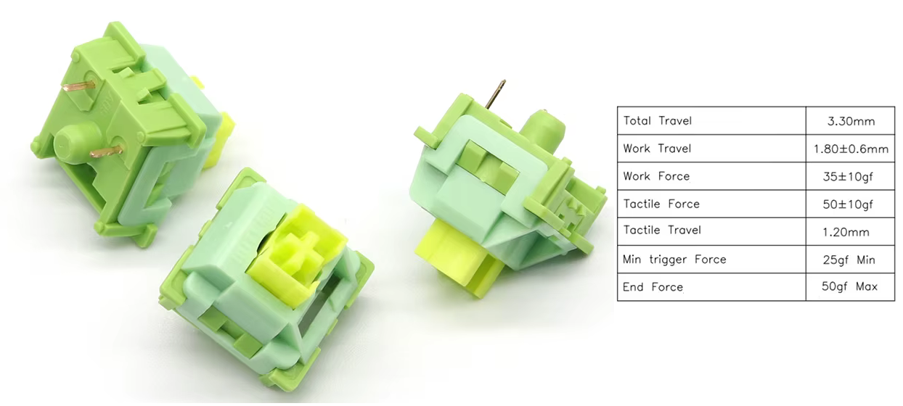
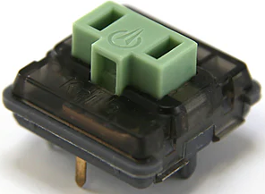
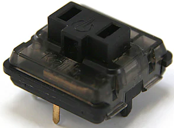
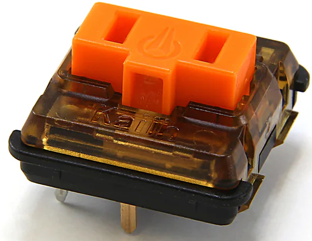
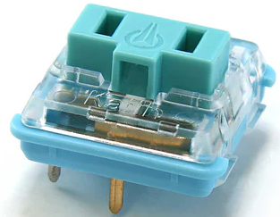
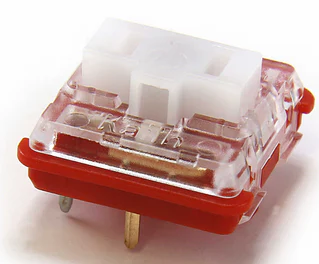
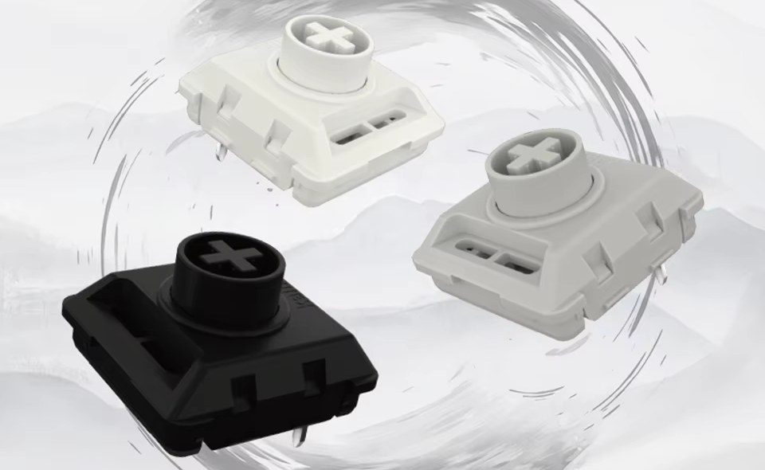

# Ordering And Build Guide

Due to the amount of choice that this keyboard gives you, the ordering and build guides are built up a bit like a flow chart. You'll make some decisions, one by one, and then you'll be given a shopping list at the end.

# Choice #1: Switch Type

First, you will need to choose whether you want to build your Apiaster with MX or Choc switches. 

**You will need a total of 50 switches for a full keyboard, but valid builds exist for [reduced key counts](). If your desired switch is sold in packs of 45, or in both packs of 30 and 10, have a look and see if you would prefer one of the reduced key count designs.**

| Switch Type | Notes | Height |
|----|---- |----|
| MX | Cheap, lots of choice (feel, sound, weight, tactileness). Taller, actuation point is further from the resting state. |18mm |
| Choc V1| More expensive, less choice (but still very good choices available). Needs special keycaps, most of which are smaller than the spacing of the Apiaster. Shorter, actuation point is close to the resting state. | 10.6mm |
| Choc V2| Still pricy, but a bit cheaper than the nicest V1 switches while having similar quality of feel. MX stem, so can use cheaper low profile MX switches. Still short, but not *as* short as Choc V1. Typically heavier weight switches compared to V1. | 12mm |

Picking a switch can be an ordeal due to the sheer amount of choice. *You can always switch out switches within both of these types, but you will not be able to switch from one to the other.*

## MX
For MX switches, [ThereminGoat](https://github.com/ThereminGoat/switch-scores) is well known for reviewing switches. If you don't have any experience with MX switches, my personal recommendation is to pick something cheap that is tactile with a weight of around 35-50g. 

|| 
|:--:| 
| *The [Outemu silent lemon v3](https://www.aliexpress.com/item/1005007140434837.html) is an example of such a cheap tactile switch.* |

## Choc V1
For choc switches, you have the choice between V1 and V2. V1 is much more limited in choice for keycaps, but is a bit lower. If you pick V1, then the choice of switch is really quite easy: Get either the ambients or the sunsets from [lowprokb](https://lowprokb.ca/collections/switches) or one of their resellers. If you must get a clicky V1, get the robins. All other options are mediocre when compared with those (though there may be more nicer choc V1 switches on the market in the future). If you want a cheaper choc V1, I would recommend the pro reds to start.

| | | | | |
| :--: | :--: | :--: | :--: | :--: | 
| *Ambient Twilight, 35g weight* | *Ambient Nocturnal, 20g weight* | *Sunset Tactile, 40g weight* | *Clicky Robins* |*Pro Reds* |

All of the above can be obtained from [lowprokb](https://lowprokb.ca/collections/switches). I would suggest going through their international vendors list if you want one of their specialised switches (ambients or sunsets). For the others, you may find them cheaper in one of the vendors listed on [kbd.news](https://kbd.news/vendors/switch), or on Aliexpress.

## Choc V2

For choc V2, get these:

|| 
|:--:| 
| *[Kailh Choc V2 Elenments Series](https://www.aliexpress.us/item/3256807071072267.html)* |

These switches exist under multiple names; if it says "full POM" somewhere, then it's probably one of these. For example, they are also sold by Lofree [here](https://www.lofree.co/collections/switches). They're all very nice, get whichever type (linear/tactile/clicky) you prefer. As with Choc V1, other types of Choc V2 switches are not really worth discussing. I also suspect that Kailh's [four seasons](https://www.aliexpress.us/item/3256807506486516.html) lineup uses the same technology, so you could get those too.

## Keycaps

Whichever switch type you choose will also need suitable keycaps. You should really do some searching yourself, but I'll drop some links here anyway.

 Choc V2 needs low profile MX keycaps. For my build with Choc V2, I chose [a cheap XVX set](https://www.aliexpress.us/item/3256808009058126.html). For MX, any standard MX keycap set will do - [this set](https://www.aliexpress.com/item/1005005386897424.html) seems to be particularly cheap. For choc V1, the most likely (legended, blanks have more choice \& you can 3D print them) sets you'll find are [chosfox](https://www.aliexpress.us/item/3256805104770064.html) or [MBK legends](https://fkcaps.com/keycaps/mbk/legend-40s). Note that both of these have smaller spacing compared to MX, so you'll have larger gaps between your keys as this keyboard is "MX spaced".

 Again, search yourself for the exact set you want. For each option there will be different aesthetics at similar price points, take your time.

# Continue Here

**Disclaimer: The MX version of the PCB has not yet been tested. I *expect* it to work. If this is too much risk for you, you can subscribe to [this issue](https://github.com/Nick-Munnich/apiaster/issues/1) to get a notification when the MX version has been tested.**

[Click here to continue the guide with MX switches.](./mx-ordering-guide/mcu.md)

[Click here to continue the guide with Choc switches.](./choc-ordering-guide/mcu.md)

# Upgrade Guide

If you have an Apiaster with an RP2040-Zero and you wish to upgrade it to use one or two XIAO nRF52840 controllers, you can follow [this guide](./mcu-upgrade-guide.md) to do so.
