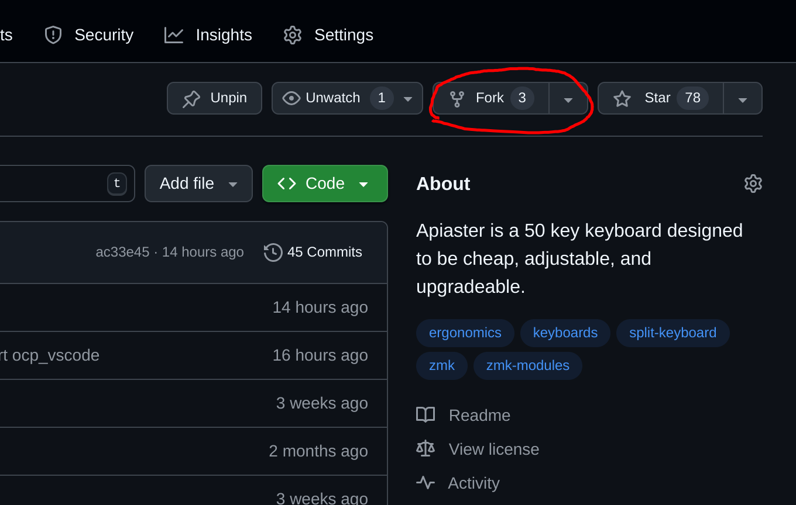
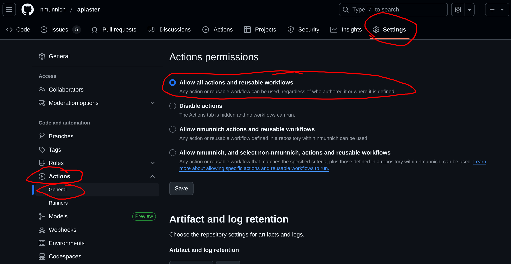
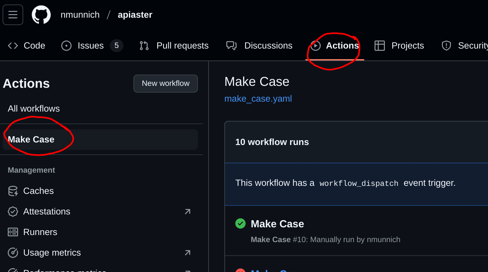
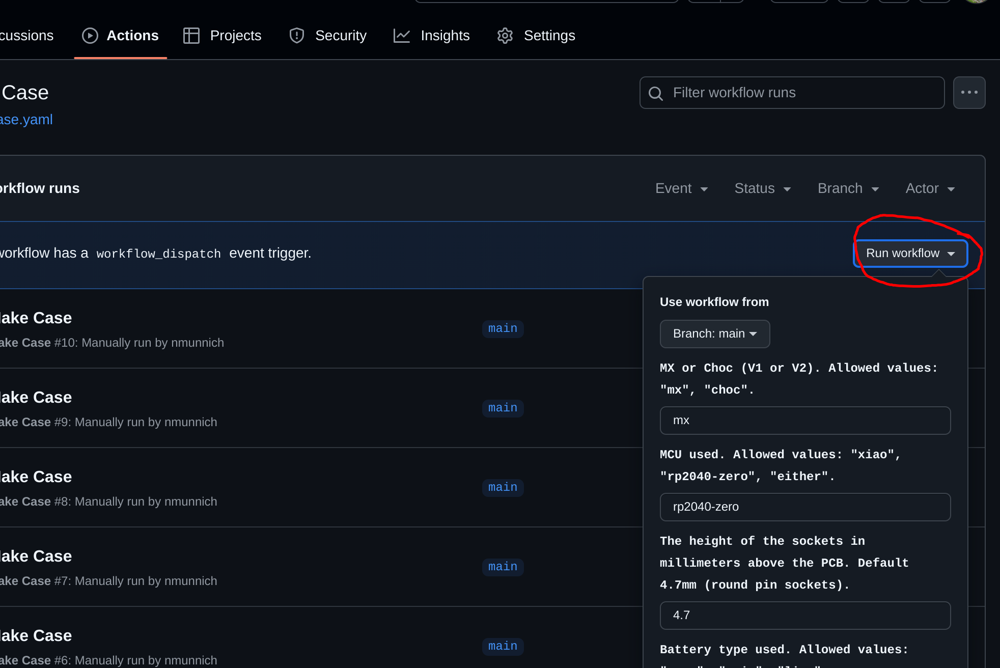
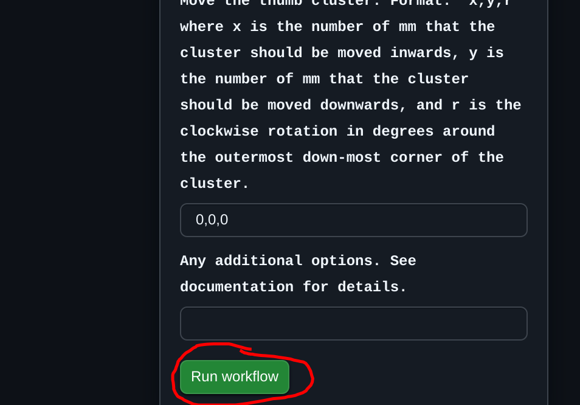
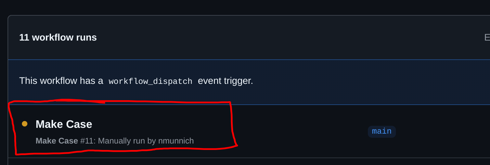
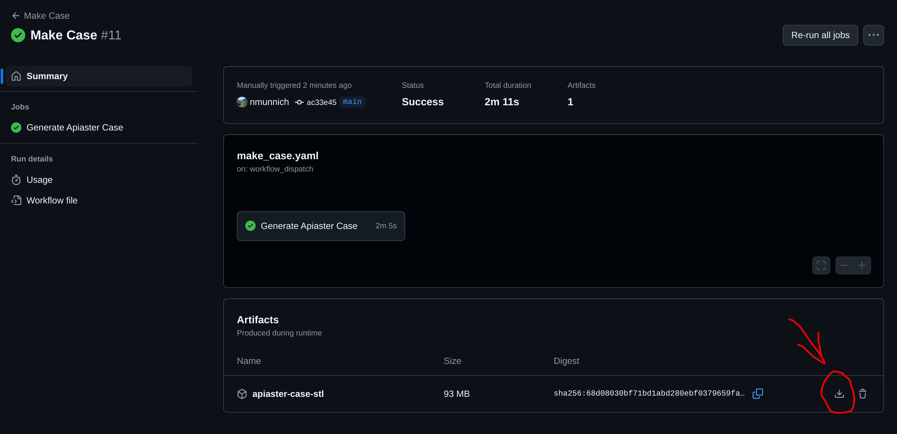

# Generating The Case

You will be running the case generator via GitHub Actions. To do so, start by forking this repository



Next, make sure that you have GitHub Actions enabled in your repository. Go to `Settings` and then the Actions (General) category:



Make sure "Allow all actions and reusable workflows" is selected (click save!).

Now navigate to the `Actions` tab, and click on the "Make Case" action on the left:



You can then click `Run workflow` and adjust any settings you desire, then click `Run workflow` at the bottom.




After refreshing the page, a new workflow should appear:



Click on it, and wait for it to finish running. Once it is done, your case files should appear as an artifact (refresh the page if they don't appear):



## Extra Settings

In addition to the settings listed, there are also the following more niche settings which you can apply:

|Command|Options|Default|Description|
|---|---|---|---|
|`--low-case`  |true/false|false|          If enabled, this will lower the height of the tray and frame such that they stop at the switch snap-on point. (You may need to expose some components)|
|`--no-usb-a`  |true/false|false|Set this flag if you're using a xiao and there will be no usb-A 3.0 port.|
|`--block-usb` |true/false|false|Set this flag if you're using a xiao and there is a soldered usb-A 3.0 port that you wish to cover up.|
|`--smd-diodes`  |true/false|false| Set this flag if you are using SMD diodes. Will slightly reduce the height of the case. | 
|`--expose` |[{mcu,battery,usb} ...]| none of them| Select components which shouldn't be covered up by the tray. Note that 'battery' only has an effect if 'coin' is selected.|
|`--outer-keys`| {all,upper-1.5u,upper-1u,lower,none}| all|Which outer pinky keys should be enabled. All sets the upper key to 1.5u.|
|`--thumbs` |[{reachy,tucky,middle} ...]| all of them| Select which thumbs to use. |
|`--pinkies` |[{upper,home,lower} ...]|all of them| Select which pinky keys to use. Default all.|

Apply these by inputting them into the `Additional Options` field. They should be space-separated. Booleans like `--low-case` do not need an additional argument. For example:

```
--low-case --expose mcu --thumbs reachy --thumbs tucky
```

# Building The Case

Once you have the case of your choice, follow the [case assembly guide](./build-guide/case.md).
