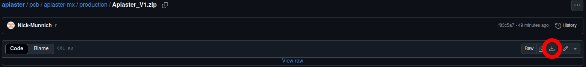
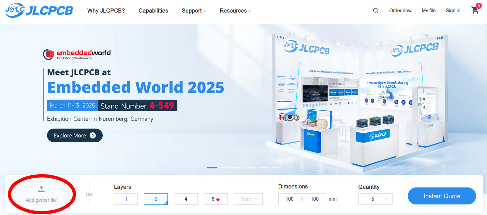

# Ordering List

You have made the big choices. There are still some minor choices to make, though, but these will be presented here. 

The links chosen are mostly from Aliexpress to take advantage of shipping. Other sources are available for all of these if you do some digging. If ordering from Aliexpress with price as a limiting factor, you *might* be able to find some of these for cheaper by taking advantage of their "bundle deals".

## PCB

At the moment, the go-to for price for PCB manufacturing is JLCPCB. You will need to download this "gerber" file: [Click to navigate to file](../../pcb/apiaster-mx/production/Apiaster_V1.zip).

Once you have it, go to [JLCPCB](https://jlcpcb.com/).

 

Click on "Add Gerber File" and select the file you just downloaded (or drag and drop). You can in general leave all options as the default, but there are three you may wish to change:
 * PCB Color, an aesthetic choice. Pick your favorite.
 * Surface finish: I recommend Lead-free HASL for health and environmental reasons. Leaded HASL is best to pair with leaded solder and vice versa. ENIG looks fancy, but is pricy and entirely unnecessary for this board. Note that some combinations of surface finish + color may incur increased prices/build times. Lead-free HASL will incease the price slightly.
 * Mark on PCB: By default JLC includes a serial number, you can remove the number at no cost (this wasn't always the case, check if the price changes).

**Minimum price at time of writing, not including shipping, taxes, customs, etc:  $10.60**

## Mandatory Components

| Item | Amount | Link | Price (at time of writing)|Notes|
|---|---|---|---|----|
|1N4148 Diodes|70|https://www.aliexpress.com/item/4000142272546.html|$1.33 per 100|You can choose *either* these or the below ones, depending on what you prefer (these are easier for beginners).|
|1N4148S Diodes|70|https://www.aliexpress.com/item/1005005707644429.html|$1.03 per 100|These result in a slightly shorter case. Pick SOD123, not SOD323.|
|MX Switches|50|[Assuming previous section's Outemu](https://www.aliexpress.com/item/1005007140434837.html)|$11.56 for 70|As discussed previously.|
|MX Keycaps|50|[Assuming previous section's cheap set](https://www.aliexpress.com/item/1005005386897424.html)|$3.42 for the set|As discussed previously.|
|Hotswap Sockets|50|https://www.aliexpress.com/item/1005007232040760.html|$3.63 for 70| Make sure you're getting the shape suitable for MX.|
|RP2040-Zero MCU|1|https://de.aliexpress.com/item/1005007650325892.html|$1.67 each|Get one *without* the sockets already soldered on.|
|USB-A 3.0 female connector|2|https://de.aliexpress.com/item/1005003729287891.html|$1.08 for 5|Pick the "90 degree warped mouth".|
|USB-A 3.0 cable|1|https://de.aliexpress.com/item/1005001560424564.html|$2.03 each|As mentioned, you can purchase the parts for a custom cable instead.|

**Total minimum component cost at time of writing, not including shipping, customs, tariffs, etc.:  $25.75**

Obviously shipping, customs, taxes, and tariffs may still need to be considered and can vary wildly depending on your location.

## Recommended Components

The following parts are optional, but *highly* recommended:

| Item | Amount | Link | Price (at time of writing) |Notes|
|---|---|---|---|----|
|MCU round hole female sockets|2 7pin strips|https://www.aliexpress.com/item/32849903666.html|$1.41 for 5 40pin strips|You can easily snap off 7 pin lengths.|
|MCU square female sockets|2 7pin strips|https://www.aliexpress.com/item/4001198421663.html|$0.94 for 10  pin strips|These are *significantly* taller profile. I'm only listing them because they are slightly cheaper, I recommend the lower profile approach.|
|MCU round hole pins|14|https://www.aliexpress.com/item/32945586364.html|$0.96 for 4x5 or $1.35 for 4x20|You will be yanking the pins out from the plastic, make sure you have two pliers or similar for this purpose. I recommend buying the 20 piece 4 pin version.|
|Spare Wire|~50cm maybe?|https://www.aliexpress.com/item/4000580738993.html|$0.91 per coil| Used to reattach the thumb cluster if you want to move it. Also useful for bodge wires if you made a mistake.|

The RP2040-Zero comes with a socket that *can* be soldered to the PCB directly, but using proper sockets is highly recommended. These will allow you to remove the MCU from the PCB, allowing you to upgrade to a XIAO nRF52840 in the future if you ever so desire. **You will find it almost impossible to upgrade without socketing**. It also serves as insurance in case something breaks, it'll be much easier to test, fix, and replace if you can remove the MCU.

The round hole sockets with pins are recommended as they are lower profile. Square sockets can be used, but are bulkier and not quite as nice as a result - cheaper, though. For more information on the low profile socket approach, read through [this page](https://github.com/joric/nrfmicro/wiki/Sockets).

## Case Components

If you are ordering the included case design from somewhere (JLC is also a good source for this), then you should [obtain the case STL](../case.md) and order the case from whichever source you prefer.

The case was designed to be 3D printed with a layer height of 0.1mm. For FDM, this means a 0.2mm nozzle is ideal. If you are printing the case yourself with an FDM printer, this is your opportunity to purchase such a nozzle.

The following parts are necessary to build the included case design. Note that you can use the keyboard without a case, and you can also design your own case which may not need these parts. If you wish to move the thumb cluster, a case or additional structure of *some* kind is mandatory to secure it in place.

| Item | Amount | Link | Price (at time of writing) |Notes|
|---|---|---|---|----|
|6mm M2 sunk screws|12|https://www.aliexpress.com/item/4001199728978.html|$0.92 per 50|Make sure it's the 6mm version.|
|1.6mm tall M2 nuts|12|https://www.aliexpress.com/item/1005007593861199.html|$0.90 per 50|Select the M2 version.|
|8mm outer diameter, 2mm tall silicone bumpers|10|https://www.aliexpress.com/item/1005006382486165.html|$1.28 per 100|Make sure measurements match.|

The case/pcb also allows for two different tenting options; Magsafe-style magnets and the SplitKB tenting puck. The below are optional components to use for this. Note that you can obtain cheaper tenting options via e.g. 3d printing, or with cheap phone stands, magsafe and the tenting puck are merely the options which allow for the most flexibility at the cost of price. **I have not tested these particular products in detail, they are merely those which I would pick myself if I had the desire**.

| Item | Amount | Link | Price (at time of writing)| Tenting Style |Notes| 
|---|---|---|---|----|----|
|Magsafe stickers|2|https://www.aliexpress.com/item/1005006994459890.html|$1.12 each|Magsafe||
|Tenting Puck|2|https://splitkb.com/products/tenting-puck|€34,94 for 2|Puck|SplitKB also sells very good, but expensive, tripods that can go on top of your table.|
|Clamp with 1/4" thread|2|https://www.aliexpress.com/item/1005005962644108.html|$6.44 each|Both| Clamp onto the side of your desk or onto your chair, the tenting puck will screw in while the magsafe stickers will need an adapter. The branded and more reliable version is from the brand "SMALLRIG". I've also personally had positive experiences with "NEEWER".|
|Magsafe 1/4" adapter|2|https://www.aliexpress.com/item/1005006074567830.html|$6.50 each|Magsafe||
|Magsafe Phone Stand|2|https://www.aliexpress.com/item/1005007052940305.html| $7.30 each|Magsafe| You really want one with a good wide stable base, otherwise it risks toppling.|

# Tools

You will *need* the following tools:
 * A soldering iron. You don't need to go *super* expensive with this, but I would avoid the incredibly cheap $2 soldering irons. That said, good quality solder is arguably more important than a good quality soldering iron. I use an older, pricier model off of Ebay. I've heard good things about the [pinecil](https://pine64.com/product/pinecil-smart-mini-portable-soldering-iron/) and [this option from Aliexpress](https://www.aliexpress.com/item/1005005196528703.html). Do some shopping around and researching for this option, if you cannot obtain access to one some other way.
 * Good quality solder. The ideal solder imo would be SAC305 lead-free solder wire, but it is on the expensive side so shop around a bit - aim for no-clean, lead-free at a lower melting point. If you find lead acceptable, decent leaded solder can be found for much cheaper. If you are using only SMD components, then I recommend some 217C lead-free solder paste. I found what I believe could be a decent choice [here](https://de.aliexpress.com/item/1005006956427027.html), but you will *need* [flux](https://www.aliexpress.com/item/1005006568158452.html) to go along with it, as it doesn't have any in its core (unlike most solder wire).
 * [Wire cutters](https://www.aliexpress.us/item/2251832814528613.html)

The following tools are highly recommended:
 * [Switch Puller](https://www.aliexpress.com/item/1005006675061450.html) 
 * [Multimeter](https://www.aliexpress.com/item/1005007009854702.html) (one with a continuity mode that beeps)
 * [Breadboard](https://www.aliexpress.com/item/1005007557572041.html)
 * [Flux](https://www.aliexpress.com/item/1005006568158452.html), either in pen or syringe form. This particular flux has not been tested by me, but I dislike the one that I have so I won't be recommending it. Get no-clean.
 * [Desoldering braid](https://www.aliexpress.com/item/1005007514789306.html)
 * [Spare wire](https://www.aliexpress.com/item/4000580738993.html) (also a recommended component)
 * [Silicone soldering mat](https://www.aliexpress.com/item/1005005472358780.html), to protect your working area.
 * [Precision tweezers](https://www.aliexpress.com/item/1005005589349988.html)

 A multimeter is **crucial** for both troubleshooting and confirming that you did everything correctly. You can skip it if you love living on the edge, though.

If you are in school or university, I would highly suggest that you check which resources your school can provide to you. Universities especially tend to have soldering equipment available for student use.

# Build Guide

[Click here to continue with the build guide](../build-guide/pcb.md). 